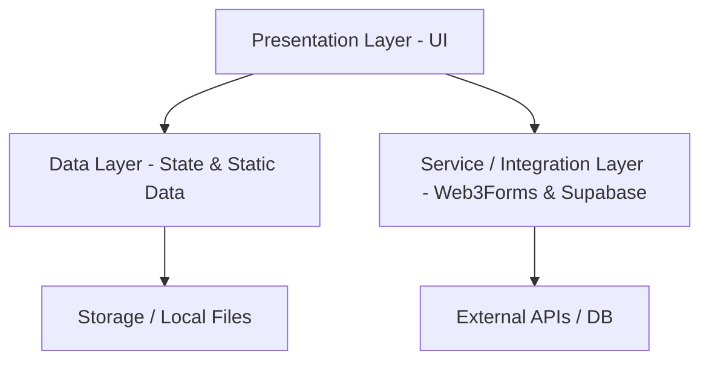

# Separation of Concerns (SoC) & Layered Architecture

Dokumen ini menjelaskan struktur arsitektur, organisasi folder, dan pembagian tanggung jawab (Separation of Concerns) yang diterapkan pada proyek **Personal Portfolio Website – Muhammad Ilham Setiawan**.

---

## 1. Konsep Utama
Arsitektur proyek ini dirancang menggunakan prinsip **Layered Architecture (Arsitektur Berlapis)** untuk memisahkan logika bisnis, pengelolaan data, dan presentasi UI. Keuntungan dari pendekatan ini meliputi:
* **Maintainability**: Memudahkan perubahan pada satu bagian kode tanpa merusak bagian lainnya.
* **Reusability**: Komponen UI yang murni (stateless/presentational) dapat digunakan kembali di berbagai tempat.
* **Scalability**: Memudahkan migrasi dari data statis ke data dinamis (Supabase CMS) tanpa merombak total tampilan UI.

---

## 2. Lapisan Arsitektur (Architecture Layers)

Proyek ini dibagi menjadi tiga lapisan utama:



### 2.1. Presentation Layer (Lapisan Presentasi)
Bertanggung jawab penuh atas tampilan visual (UI/UX), penanganan interaksi user, dan rendering elemen web. Lapisan ini **tidak boleh** memproses logika bisnis yang kompleks atau menyimpan data secara permanen.

* **Lokasi**: `/components` dan `/app`
* **Sub-kategori Komponen**:
  * **Layouts**: Struktur pembungkus global (seperti `Navbar.tsx` dan `Footer.tsx`).
  * **Sections**: Halaman atau bagian utama website (seperti `Hero.tsx`, `About.tsx`, `Projects.tsx`, `Contact.tsx`).
  * **UI Components**: Komponen atomik/kecil yang dapat digunakan kembali (seperti `TechIcon.tsx`, `Button`, dll.).
  * **Providers**: Pembungkus state global aplikasi (seperti `ThemeProvider.tsx` dan `LanguageProvider.tsx`).

### 2.2. Data Layer (Lapisan Data)
Menampung definisi tipe data, skema, dan data statis yang digunakan untuk mengisi konten halaman portofolio.

* **Lokasi**: `/data` dan `/types`
* **File Utama**:
  * `projects.ts`: Menyimpan data list proyek (gambar, judul, tech stack, url).
  * `certificates.ts`: Menyimpan data sertifikat (placeholder saat ini).
  * `skills.ts`: Daftar keahlian teknis yang ditampilkan pada Tech Stack tab.
  * `translations.ts`: Pusat kamus lokalisasi teks (Bahasa Indonesia & English) untuk mendukung multi-language.

### 2.3. Service / Integration Layer (Lapisan Layanan & Integrasi)
Menghubungkan aplikasi dengan layanan eksternal (third-party APIs) dan database.

* **Fungsi Saat Ini**: Web3Forms API integration di dalam `Contact.tsx` untuk mengirim pesan formulir kontak.
* **Fungsi Mendatang (CMS)**: Supabase Client SDK integration untuk melakukan query data projects/certificates secara dinamis dan memproses autentikasi admin di `/seputaradmin/login`.

---

## 3. Peta Struktur Folder
Berikut adalah representasi visual folder proyek dan peran SoC masing-masing:

```text
portfolio-milsetiawan/
├── app/                      # [Presentation] Routing Next.js (App/Page Router)
│   ├── layout.tsx            # Root layout presentasi global
│   └── page.tsx              # Main page penyusun section portfolio
├── components/               # [Presentation] Komponen UI & Layout
│   ├── sections/             # Section halaman utama (Hero, About, Projects, Contact)
│   │   ├── Navbar.tsx        # Navigasi & Bahasa/Theme Toggle
│   │   ├── Projects.tsx      # Showcase tabs (Projects, Certificates, Tech Stack)
│   │   └── Contact.tsx       # Formulir kontak & Sosial media links
│   ├── ui/                   # Reusable atomic UI (TechIcon.tsx, dll.)
│   ├── LanguageProvider.tsx  # State Provider untuk lokalisasi Bahasa (ID/EN)
│   └── ThemeProvider.tsx     # State Provider untuk Dark/Light mode
├── data/                     # [Data] Data statis & Kamus lokalisasi
│   ├── projects.ts           # Data proyek static
│   ├── certificates.ts       # Data sertifikat static
│   └── translations.ts       # Kamus terjemahan lokalisasi (ID/EN)
├── docs/                     # Dokumentasi arsitektur & PRD proyek
│   ├── prd.md                # Product Requirements Document
│   └── soc.md                # Dokumen Separation of Concerns ini
├── public/                   # Asset statis publik (Gambar, PDF CV, Logo)
└── types/                    # [Data] TypeScript Interface & Types definition
```

---

## 4. Alur Data (Data Flow)

Alur data berjalan secara searah (unidirectional) dari data sumber ke presentasi:

1. **State Inisialisasi**: Saat aplikasi dimuat, `LanguageProvider` mendeteksi bahasa aktif (`id` atau `en`).
2. **Translasi Dimuat**: Halaman/Section mengambil kamus string dari `data/translations.ts` berdasarkan bahasa aktif tersebut.
3. **Data Rendering**: `Projects.tsx` memetakan data array dari `data/projects.ts` menjadi tampilan visual kartu proyek.
4. **Interaksi User**: Ketika tombol kirim di `Contact.tsx` diklik, data form dikirimkan ke Web3Forms API melalui request HTTPS POST.

---

## 5. Rencana Integrasi CMS (Supabase)
Ketika fase CMS Supabase diimplementasikan, pemisahan tanggung jawab akan tetap terjaga dengan skema berikut:

* **Supabase Client Layer**: Logika inisialisasi client Supabase akan diletakkan di `/lib/supabaseClient.ts`.
* **Data Fetching**: Logika pembacaan data (`select`) akan dilakukan di sisi server (Server Components) atau Client Components melalui hooks, lalu dilewatkan sebagai props ke komponen presentasional `Projects.tsx`.
* **Admin Auth**: Logika autentikasi login admin diletakkan di route `/seputaradmin/login` menggunakan Supabase Auth API, terpisah sepenuhnya dari tampilan publik. RLS (Row Level Security) di sisi Supabase akan mengamankan tabel database secara mandiri.
